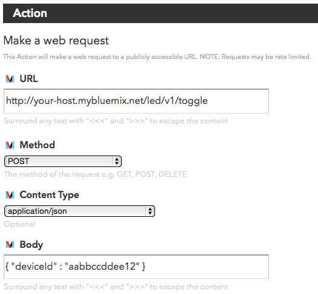

# BluemixでIoTしてみた

\#bluemix \#iot \#mqtt

@f_nishio


# Summary
Qiitaにも、まとめてあります。
- http://qiita.com/f_nishio/items/0b5161207a110f7bbef4
- http://qiita.com/f_nishio/items/33b4922ccf705d74b002
- http://qiita.com/f_nishio/items/f1652dfdecd12649e7ad

サンプルコードは github [fnishio/mqtt-sample](https://github.com/fnishio/mqtt-sample) です。


# IoT
3つのパターン

- モニタリング
  - センサーからデータを収集、アプリケーションが保管、分析
  - 車両の位置、速度のモニタ
  - 心拍数、生体信号リモートモニタ、医療情報記録・分析
- リモート制御
  - 外からエアコンを起動
- M2M (Mono 2 Mono) 通信
  - 土壌湿度センサー情報から、スプリンクラーを制御

http://www.ibm.com/developerworks/jp/cloud/library/cl-raspberrypi-iot-remote-monitoring-app/index.html


# MQTT
IoTには、センサデバイスからの情報収集や一斉同報通知など安全に通信するためのプロトコルが必要
>MQTT is a machine-to-machine (M2M)/"Internet of Things" connectivity protocol.
It was designed as an extremely lightweight publish/subscribe messaging
transport」（http://mqtt.org/）

MQTT = MQ Telemetry Transport


# IBM Bluemix


## IoTサービス

IoTやってみよう！

- MQTT broker が必要
- IoTアプリケーションをBackendで動かしたい

さて、どうする…

**IBM Bluemixがあるじゃないか！**

- IBM Internet of Thnings Foundation (MQTT Broker)
- Node-REDでお手軽アプリ作成


## Setup

1. [Bluemix](https://console.ng.bluemix.net)にsign in
1. 「カタログ」の「ボイラープレート」から「Node-RED starterコミュニティ」を作成
1. 「カタログ」の「モノのインターネット」から「Internet of Things」を作成


# Sample - モニタリング
こんなものを作ってみる
- Device: 定期的にインクリメントされるカウンター値をpublishする
- App: Deviceからのカウンター値をモニター(subscribe)して、カウンター値が5になったらリセットするようDeviceにコマンドをPublishする

道具立ては
- Device: python + [paho-mqtt](https://pypi.python.org/pypi/paho-mqtt)
- App: Node-RED

http://www.ibm.com/developerworks/jp/cloud/library/cl-mqtt-bluemix-iot-node-red-app/

## Device


### 接続機器の登録
IoT Foundationのdashboardを開いて接続する機器を登録する。
登録後に表示される認証用のAuthentication TokenはMQTT Broker接続時の認証パスワードとして使う。


### MQTT Brokerにつなぐ
```python
client_id = "d:{org_id}:{type_id}:{device_id}"
endpoint = "{org_id}.messaging.internetofthings.ibmcloud.com"
client = mqtt.Client(client_id)
client.username_pw_set("use-token-auth", PASSWORD)
client.on_connect = on_connect
client.on_message = on_message
client.connect(endpoint, 1883)
```
``org_id, type_id, device_id, PASSWORD``はIoT Foundationへの登録情報を元に適切に設定する。


### Event Publish
1.5秒ごとに``count``をインクリメントしながらpublishする。
```python
count = 0
while client.loop() == 0:
    msg = json.dumps({ "d" : { "count" : count } });
    client.publish("iot-2/evt/eid/fmt/json", msg, 0, True)
    print("sent: " + msg)
    time.sleep(1.5)
    count = count + 1
```


### Command subscribe
- Brokerに接続したら``iot-2/cmd/cid/fmt/json``トピックをsubscirbe
- ``reset``コマンドが来たら``count``をコマンドに含まれている値に再設定

```python
def on_connect(client, userdata, flags, rc):
    client.subscribe("iot-2/cmd/cid/fmt/json")

def on_message(client, userdata, msg):
    global count
    payload = json.loads(msg.payload.decode())
    if payload['cmd'] == "reset":
        count = payload['count']
```


## Service

### Node-RED
サービス側のアプリはNode-REDで手っ取り早く作る。


### Event subscribe
``MQTT Device``から送信されるトピック``iot-2/evt/eid/fmt/json``のイベントをsubscribeする


### Monitor
countイベントをモニターして、countが4を超えたら次のフローへ進む


### Command payload
resetコマンドを組み立てる


### Command publish
deviceIdの機器に対して、トピック``iot-2/cmd/cid/fmt/json``にコマンドをpublish


## 実行
```
nishio@macbookair:0$ python3 device.py                  (~/project/mqtt-sample)
sent: {"d": {"count": 0}}
sent: {"d": {"count": 1}}
sent: {"d": {"count": 2}}
sent: {"d": {"count": 3}}
sent: {"d": {"count": 4}}
sent: {"d": {"count": 5}}
iot-2/cmd/cid/fmt/json b'{"cmd":"reset", "count": 0}'
sent: {"d": {"count": 0}}
sent: {"d": {"count": 1}}
```


# Sample 2 - リモート制御
こんなものを作ってみる。

- Device: MQTT で toggle コマンドを受け取るたびに、LEDのoff/onを切り替える。
- App: Web APIを叩かれるたびに、toggleコマンドをpublishする。
- Controller: [Do Button](https://ifttt.com/products/do/button)を使ってWeb APIを叩く。


## Device


### 接続機器の登録
IoT Foundationのdashboardを開いて接続する機器を登録する。
登録後に表示される認証用のAuthentication TokenはMQTT Broker接続時の認証パスワードとして使う。


### MQTT Brokerにつなぐ
```python
client_id = "d:{org_id}:{type_id}:{device_id}"
endpoint = "{org_id}.messaging.internetofthings.ibmcloud.com"
client = mqtt.Client(client_id)
client.username_pw_set("use-token-auth", PASSWORD)
client.on_connect = on_connect
client.on_message = on_message
client.connect(endpoint, 1883)
```
``org_id, type_id, device_id, PASSWORD``はIoT Foundationへの登録情報を元に適切に設定する。


### Command subscribe
- Brokerに接続したら`iot-2/cmd/led/fmt/json`をsubscribe
- `toggle`コマンドが来たらGPIO PINの状態を変える

```python
def on_connect(client, userdata, flags, rc):
    client.subscribe("iot-2/cmd/led/fmt/json")

def on_message(client, userdata, msg):
    payload = json.loads(msg.payload.decode())
    if payload['cmd'] == "toggle":
       # control GPIO
       global on_off
       on_off = ~on_off
       GPIO.output(LED_PIN, on_off)
```


## Service


### Node-RED
サービス側のアプリはNode-REDで以下のフローを実装。


### Web API
POSTで操作対象となる機器のdeviceIdを受け取る Web API。


| Method | URL    |
|--------|---------------|
| POST   | led/v1/toggle |

| Type | Params | Valuse | Description |
|------|--------|--------|------|
| json | deviceId | string | 操作対象のdevice ID |


### Command payload
toggle操作を行うcommand payloadを組み立てる。


### Command publish
deviceId の機器に対して、トピック`iot-2/cmd/led/fmt/json`にコマンドをpublishする。


## Controller


### Recipe
Do ButtonにRecipeを設定。




## 実行

[実行の様子 (mp4)](./images/toggle_led.mp4)


# Sample 3 - Android センサーのモニタリング
こんなものを作ってみる。

- Android: Lightセンサーの値をMQTT eventとしてpublishする。
- App: センサー値のeventをWebSocketに出力する。ブラウザからWebSocketに接続してセンサー値をモニタリングする。


## Device


### 接続機器の登録
IoT Foundationのdashboardを開いて接続する機器を登録する。
登録後に表示される認証用のAuthentication TokenはMQTT Broker接続時の認証パスワードとして使う。


### MQTT Brokerにつなぐ
Android版のpaho mqttライブラリを使ってMQTT Brokerに接続する。

```java
MyMqttClient(Context context) {
    mClient = new MqttAndroidClient(context, MyMqttConfig.ENDPOINT_URL, MyMqttConfig.CLIENT_ID);
}

public void connect() {
    MqttConnectOptions options = new MqttConnectOptions();
    options.setUserName(MyMqttConfig.USER);
    options.setPassword(MyMqttConfig.PASSWORD.toCharArray());
    try {
        mClient.connect(options, null, new IMqttActionListener() {
            @Override
            public void onSuccess(IMqttToken mqttToken) {
              // ...
            }

            @Override
            public void onFailure(IMqttToken arg0, Throwable arg1) {
              // ...
            }
        });
    } catch (MqttSecurityException e) {
        // do nothing.
    } catch (MqttException e) {
        // do nothing.
    }
}
```


### Event publish
SensorEventListenerのonSensorChanged()でセンサー値を監視して`iot-2/evt/sensor/fmt/json`にpublishする。
```java
@Override
public final void onSensorChanged(SensorEvent event) {
    float value = event.values[0];
    mClient.publish("sensor", "light", value);
}
```


# Service


## Node-RED
サービス側は、2つのフローを実装する。
- センサー値のイベントをWebSocketに送信するフロー

- WebSocketの値を監視するWebページをブラウザに送るフロー


### Event subscirbe
MQTT Deviceから送信されるトピック`iot-2/evt/sensor/fmt/json`のイベントをsubscribeして、
WebSocket に送信するデータを組み立てる。


WebSocket `/ws/sensor`にデータを送る。


### Monitoring
`/sensor`にHTTP GETされたら以下のhtmlをブラウザに返す。WebSocket `/ws/sensor`につないで、
ブラウザ上のセンサー値表示を更新し続ける。

```html
<head>
  <title>Sensor</title>
  <script type="text/javascript">
  var wsUri = "ws://{{req.headers.host}}/ws/sensor";
  var ws = new WebSocket(wsUri);

  ws.onmessage = function(ev) {
    var payload = JSON.parse(ev.data);
    var device = document.getElementById('device');
    device.textContent = payload.deviceId;
    var sensor = document.getElementById('sensor');
    sensor.textContent = payload.light;
  }
  </script>
</head>

<body>
    <div>Sensor Monitor:</div>
    <div>
      Id: <span id="device">xxx</span>
      Value:<span id="sensor">00</span>
    </div>
</body>
```


